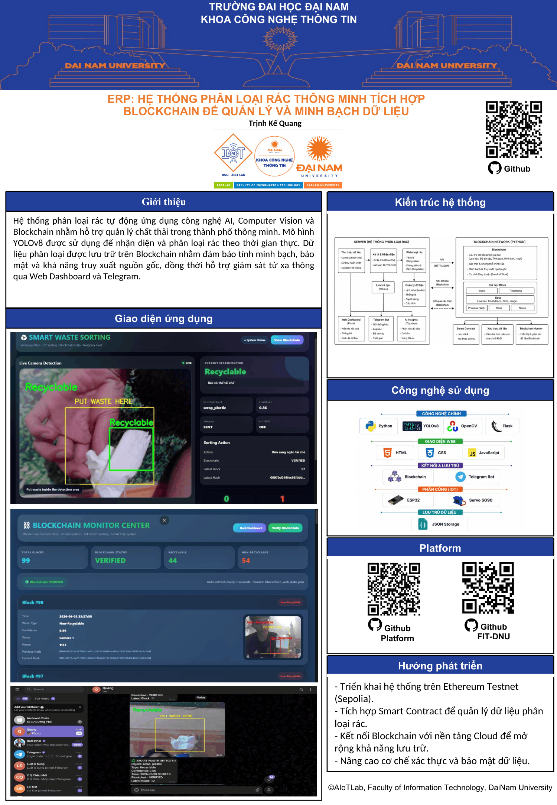
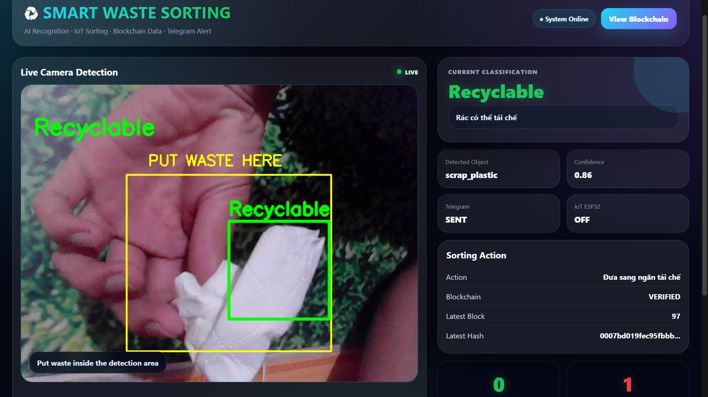
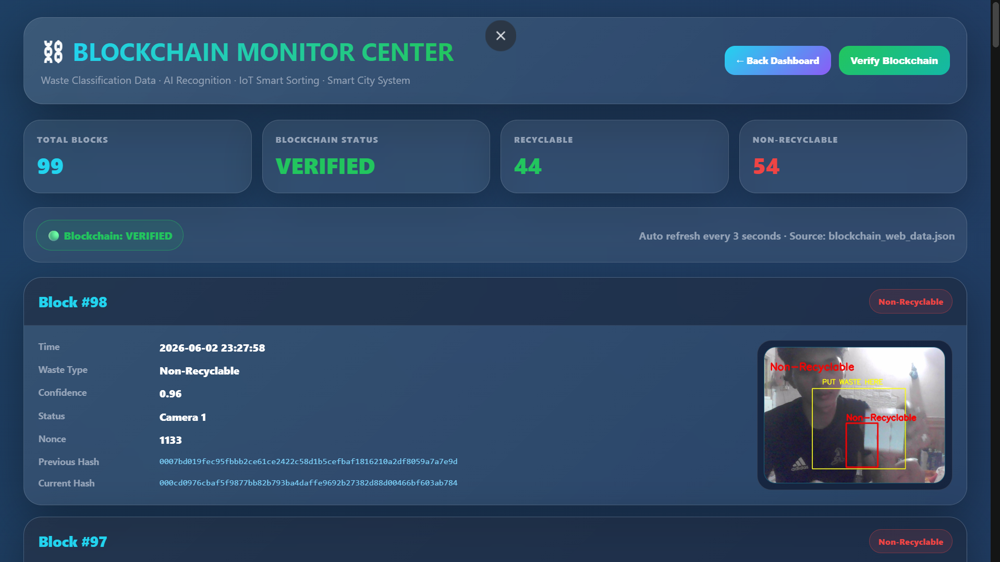
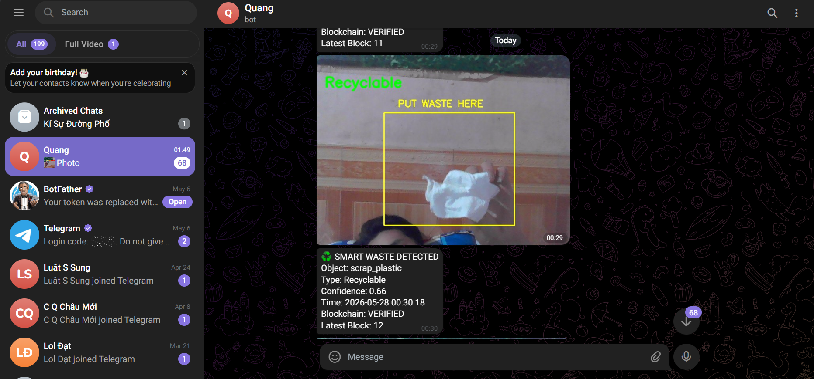

<div align="center">

# ♻️ SMART WASTE AI

## HỆ THỐNG PHÂN LOẠI RÁC THÔNG MINH TÍCH HỢP BLOCKCHAIN

### Ứng dụng AI, Computer Vision, Blockchain và IoT trong Thành phố Thông minh

---

YOLOv8 • OpenCV • Flask • Blockchain • ESP32 • Telegram Bot

---

🎓 **TRƯỜNG ĐẠI HỌC ĐẠI NAM**

💻 **KHOA CÔNG NGHỆ THÔNG TIN**

👨‍💻 **TRỊNH KẾ QUANG**

</div>

---

# 📌 POSTER ĐỀ TÀI




---

# 📖 GIỚI THIỆU

Trong bối cảnh lượng rác thải sinh hoạt ngày càng gia tăng, việc phân loại rác thủ công gặp nhiều khó khăn, tốn thời gian và dễ xảy ra sai sót. Nhằm góp phần nâng cao hiệu quả quản lý chất thải và hỗ trợ mô hình Thành phố Thông minh, đề tài **Smart Waste AI** được xây dựng dựa trên sự kết hợp giữa Trí tuệ nhân tạo (AI), Thị giác máy tính (Computer Vision), Blockchain và IoT.

Hệ thống sử dụng mô hình **YOLOv8** để nhận diện và phân loại rác theo thời gian thực thông qua camera. Kết quả nhận diện được hiển thị trực tiếp trên Dashboard, gửi thông báo qua Telegram và lưu trữ trên Blockchain nhằm đảm bảo tính minh bạch, toàn vẹn và khả năng truy xuất dữ liệu. Ngoài ra, hệ thống còn tích hợp **ESP32 và Servo SG90** để mô phỏng quá trình phân loại rác tự động.

---

# 🎯 MỤC TIÊU ĐỀ TÀI

* Xây dựng hệ thống nhận diện và phân loại rác tự động.
* Ứng dụng YOLOv8 trong bài toán xử lý ảnh thời gian thực.
* Tích hợp Blockchain để lưu trữ dữ liệu phân loại.
* Đảm bảo tính minh bạch và khả năng truy xuất dữ liệu.
* Kết hợp AI, Blockchain và IoT trong một hệ thống hoàn chỉnh.
* Hỗ trợ định hướng phát triển Thành phố Thông minh.

---

# ⚙️ CHỨC NĂNG CHÍNH

## 🤖 Nhận Diện Rác Thời Gian Thực

* Nhận dữ liệu từ camera.
* Phát hiện đối tượng bằng YOLOv8.
* Phân loại rác thành:

  * ♻️ Recyclable (Tái chế)
  * 🚫 Non-Recyclable (Không tái chế)

## 📊 Dashboard Giám Sát

* Hiển thị camera trực tiếp.
* Hiển thị kết quả nhận diện.
* Thống kê số lượng rác.
* Theo dõi lịch sử hoạt động.
* Giám sát Blockchain theo thời gian thực.

## ⛓️ Blockchain Monitoring

* Lưu dữ liệu dưới dạng Block.
* Liên kết các Block bằng Hash và Previous Hash.
* Kiểm tra tính toàn vẹn dữ liệu.
* Phát hiện chỉnh sửa trái phép (Tampered Detection).
* Hỗ trợ truy xuất lịch sử phân loại rác.

## 📲 Telegram Notification

Hệ thống tự động gửi:

* Ảnh nhận diện.
* Loại rác.
* Độ tin cậy (Confidence).
* Thời gian phát hiện.

## 🔌 IoT Smart Sorting

ESP32 điều khiển Servo SG90 để mô phỏng thùng rác thông minh:

* ♻️ Recyclable → Servo quay sang phải.
* 🚫 Non-Recyclable → Servo quay sang trái.

---

# 🏗️ KIẾN TRÚC HỆ THỐNG

```text
┌─────────────┐
│   CAMERA    │
└──────┬──────┘
       │
       ▼
┌─────────────┐
│   OpenCV    │
└──────┬──────┘
       │
       ▼
┌─────────────┐
│   YOLOv8    │
└──────┬──────┘
       │
       ▼
┌─────────────────────────┐
│  PHÂN LOẠI RÁC THẢI     │
└──────┬───────────┬──────┘
       │           │
       ▼           ▼
 ┌─────────┐  ┌─────────┐
 │ Telegram│  │Blockchain│
 └─────────┘  └─────────┘
       │
       ▼
┌─────────────────┐
│ ESP32 + Servo   │
└─────────────────┘
```

---

# 💻 CÔNG NGHỆ SỬ DỤNG

### AI & Computer Vision

* YOLOv8
* Deep Learning
* OpenCV
* Computer Vision

### Backend & Web

* Python
* Flask
* HTML
* CSS
* JavaScript

### Blockchain

* Blockchain Python
* SHA256 Hash
* Proof of Work
* JSON Blockchain Storage

### IoT

* ESP32
* Servo SG90

### Kết Nối

* Telegram Bot API

---

# 📸 DEMO HỆ THỐNG

## Dashboard Chính



---

## Blockchain Monitor



---

## Telegram Notification



---

# 🔐 BLOCKCHAIN TRONG HỆ THỐNG

Blockchain đóng vai trò lưu trữ lịch sử phân loại rác dưới dạng các Block liên kết với nhau thông qua Hash và Previous Hash.

Mỗi Block bao gồm:

* Thời gian nhận diện.
* Loại rác.
* Độ tin cậy.
* Trạng thái camera.
* Previous Hash.
* Current Hash.
* Nonce.

Khi một dữ liệu trong Block bị thay đổi, Hash sẽ thay đổi theo và hệ thống sẽ phát hiện Blockchain bị can thiệp, từ đó hiển thị trạng thái **TAMPERED** trên Dashboard.

---

# 📂 CẤU TRÚC DỰ ÁN

```text
smart-waste-ai/
│
├── app.py
├── detect.py
├── blockchain.py
├── blockchain_data.json
├── blockchain_web_data.json
├── block_images.json
│
├── templates/
│   ├── index.html
│   └── blockchain.html
│
├── static/
│   └── captures/
│
├── dashboard.png
├── blockchain.png
├── telegram.png
│
├── Poster_Blockchain.pdf
├── Poster_Blockchain-1.png
│
└── README.md
```

---

# 🚀 CÀI ĐẶT

### Clone Repository

```bash
git clone https://github.com/trinhkequang/smart-waste-ai.git
```

### Cài Đặt Thư Viện

```bash
pip install flask ultralytics opencv-python requests numpy
```

### Chạy Chương Trình

```bash
python app.py
```

---

# 🌐 TRUY CẬP HỆ THỐNG

### Dashboard

```bash
http://127.0.0.1:5000
```

### Blockchain Monitor

```bash
http://127.0.0.1:5000/blockchain
```

---

# 📈 KẾT QUẢ ĐẠT ĐƯỢC

✅ Nhận diện rác thời gian thực

✅ Phân loại rác tái chế và không tái chế

✅ Dashboard giám sát trực quan

✅ Blockchain lưu trữ dữ liệu

✅ Kiểm tra tính toàn vẹn dữ liệu

✅ Telegram Notification

✅ ESP32 điều khiển Servo SG90

✅ Mô phỏng hệ thống quản lý rác thông minh

---

# 🔮 HƯỚNG PHÁT TRIỂN

* Triển khai Blockchain trên Ethereum.
* Tích hợp Smart Contract.
* Kết nối Cloud Database.
* Mở rộng tập dữ liệu huấn luyện.
* Hỗ trợ nhiều camera đồng thời.
* Xây dựng mô hình Smart Bin thực tế.
* Ứng dụng trong quản lý môi trường đô thị.

---

# 👨‍💻 TÁC GIẢ

**Trịnh Kế Quang**

Khoa Công Nghệ Thông Tin

Trường Đại Học Đại Nam

GitHub: https://github.com/trinhkequang


